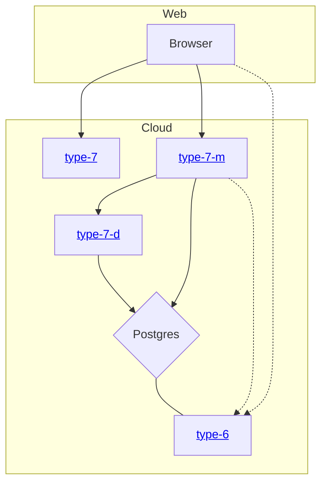

# Облако для type-6

Тут лежат конфиги для поднятия облака в яндексе.

## Ссылки

* [**Grafana**](https://grafana-shlim-tech.ru/)
* [**mipt.match**](http://mipt-match.ru/)

## Инфраструктура

## Инструкция по выкатыванию в облако

* [Terraform](https://github.com/timattt/TypeSixCloud/tree/master/terraform)
* K8S
  * [Получение кредов для доступа в кластер](https://github.com/timattt/TypeSixCloud/tree/master/k8s/clusterCredentials)
  * Накатывание прочих подов
    * [Секреты](https://github.com/timattt/TypeSixCloud/tree/master/k8s/secrets)
    * [Сервисы](https://github.com/timattt/TypeSixCloud/tree/master/k8s/services)
    * [Grafana и Prometheus](https://github.com/timattt/TypeSixCloud/tree/master/k8s/grafanaAndPrometheus)
    * [Nginx](https://github.com/timattt/TypeSixCloud/tree/master/k8s/nginx)
