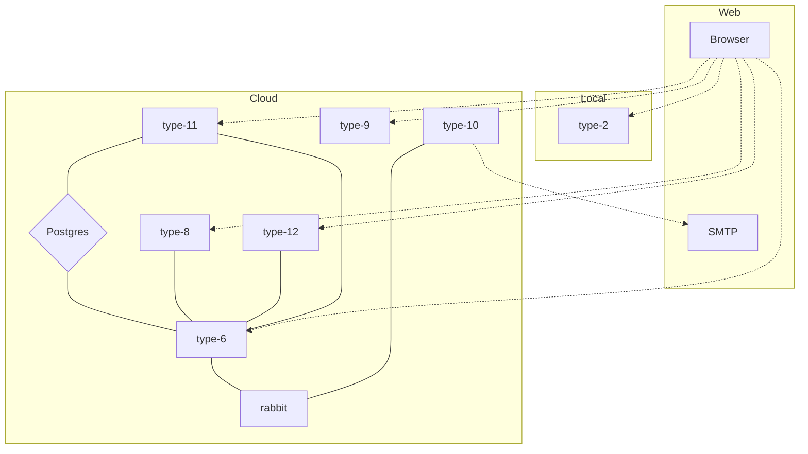

# Облако для type-6

Тут лежат конфиги для поднятия облака в яндексе.

## Ссылки

* [**Grafana**](https://grafana.mipt.io)
* [**Pattern**](http://pattern.mipt.io)
* [**SSO**](https://service.mipt.io/sso/pages/login)
* [**Rutesil**](https://rutesil.mipt.io/)

## Инфраструктура

### Список активных репозиториев

* [**Type-2**](https://github.com/timattt/TypeTwo)
* [**Type-6**](https://github.com/timattt/TypeSix)
* [**Type-6-BL**](https://github.com/timattt/TypeSixBusinessLogic)
* [**Type-8**](https://github.com/timattt/TypeEight)
* [**Type-9**](https://github.com/timattt/TypeNine)
* [**Type-10**](https://github.com/timattt/typeten)
* [**Type-11**](https://github.com/timattt/typeeleven)
* [**Type-12**](https://github.com/timattt/typetwelve)

## Инструкция по выкатыванию в облако

* [Terraform](https://github.com/timattt/TypeSixCloud/tree/master/terraform)
* K8S
  * [Получение кредов для доступа в кластер](https://github.com/timattt/TypeSixCloud/tree/master/k8s/clusterCredentials)
  * Накатывание прочих подов
    * [Секреты](https://github.com/timattt/TypeSixCloud/tree/master/k8s/secrets)
    * [Сервисы](https://github.com/timattt/TypeSixCloud/tree/master/k8s/services)
    * [Grafana и Prometheus](https://github.com/timattt/TypeSixCloud/tree/master/k8s/grafanaAndPrometheus)
    * [Nginx](https://github.com/timattt/TypeSixCloud/tree/master/k8s/nginx)
    * [Логирование](https://github.com/timattt/TypeSixCloud/tree/master/k8s/logging)
